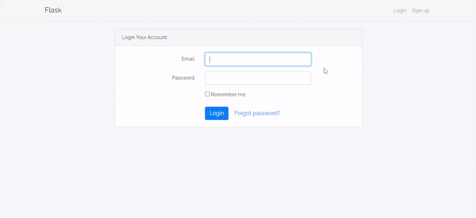
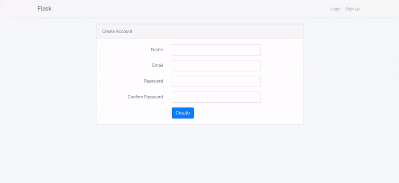
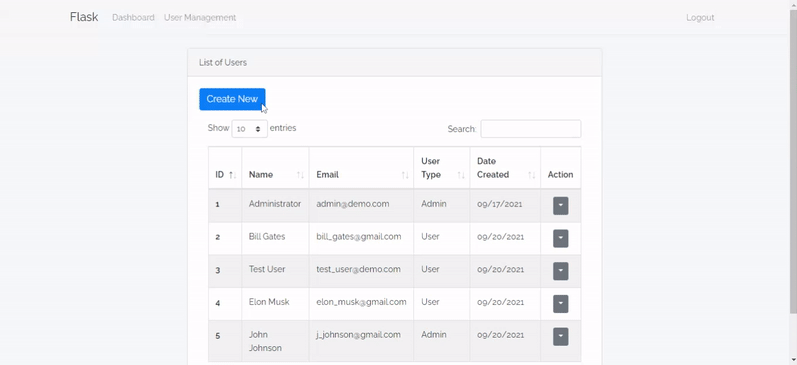
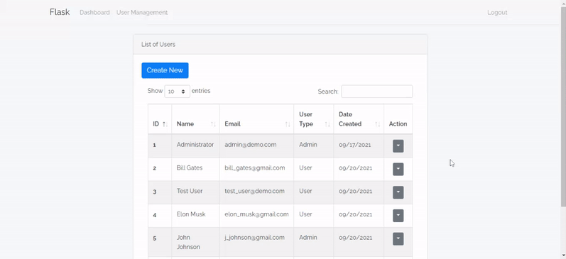

[](https://github.com/hazzillrodriguez/flask-user-management/blob/main/LICENSE)

<br />
<p align="center">
    <h3 align="center">Flask User Management</h3>
    <p align="center">
        A simple Flask user management with the boilerplate code already done for you!
        <br />
        <br />
        <a href="https://github.com/hazzillrodriguez/flask-user-management/issues">Report Bug</a>
        ·
        <a href="https://github.com/hazzillrodriguez/flask-user-management/issues">Request Feature</a>
    </p>
</p>

<!-- TABLE OF CONTENTS -->
<details open="open">
    <summary>Table of Contents</summary>
    <ol>
        <li>
            <a href="#about-the-project">About The Project</a>
            <ul>
                <li><a href="#built-with">Built With</a></li>
            </ul>
        </li>
        <li>
            <a href="#getting-started">Getting Started</a>
            <ul>
                <li><a href="#prerequisites">Prerequisites</a></li>
                <li><a href="#installation">Installation</a></li>
            </ul>
        </li>
        <li><a href="#screenshots">Screenshots</a></li>
        <li><a href="#license">License</a></li>
        <li><a href="#contact">Contact</a></li>
    </ol>
</details>

## About The Project

A simple Flask boilerplate for user management with SQLAlchemy, user authentication, and role-based authorization. If you plan to create a Flask application with user management, user authentication, and role-based authorization, this code base can serve as your starting point.

What's included?
* Blueprints
* User authentication and role-based authorization
* Flask-SQLAlchemy for databases
* Flask-WTF for forms

If you have other resources you want to create in this application, you can make a separate folder for each one of those within the `app` directory.

### Built With
* [Python](https://www.python.org)
* [Flask](https://flask.palletsprojects.com/en/2.0.x/)
* [SQLAlchemy](https://www.sqlalchemy.org/)

## Getting Started

These instructions will get you a copy of the project up and running on your local machine.

### Prerequisites

All the dependencies and required libraries are included in the file `requirements.txt`.

### Installation

Git clone or download the project files:
```
git clone https://github.com/hazzillrodriguez/travel-pass.git
```

Create and activate the virtual environment then install requirements:
```
python -m venv env
source env/Scripts/activate
pip install -r requirements.txt
```

Set the environment variables:
```
export FLASK_APP=run.py
export FLASK_ENV=development
```

Run migrations:
```
flask db init
flask db migrate
flask db upgrade
```

Modify the `create_admin.py` file with your email and password then run:
```
python create_admin.py
```

### Update Configuration Settings

Before you can use this application, you will have to configure your Gmail account and password that will be used to send emails.

Instead of editing `config.py` and checking in sensitive information into the code repository, these settings can be set using OS environment variables in your `.bashrc` or `.bash_profile` shell configuration file.
```
export EMAIL_USER = 'you_email@example.com'
export EMAIL_PASS = 'your_password'
```
If you are using a Google SMTP server, you must enable ***Less secure app access*** on your account.

Start the development web server:
```
flask run
```

## Screenshots

Login


Sign up


Admin Create Account


Admin Update Account


## License

Distributed under the MIT License. See `LICENSE` for more information.

## Contact

Hazzill Rodriguez - [LinkedIn](https://www.linkedin.com/in/hazzillrodriguez/) - hazzillrodriguez@gmail.com

Project Link: [https://github.com/hazzillrodriguez/flask-user-management](https://github.com/hazzillrodriguez/flask-user-management)